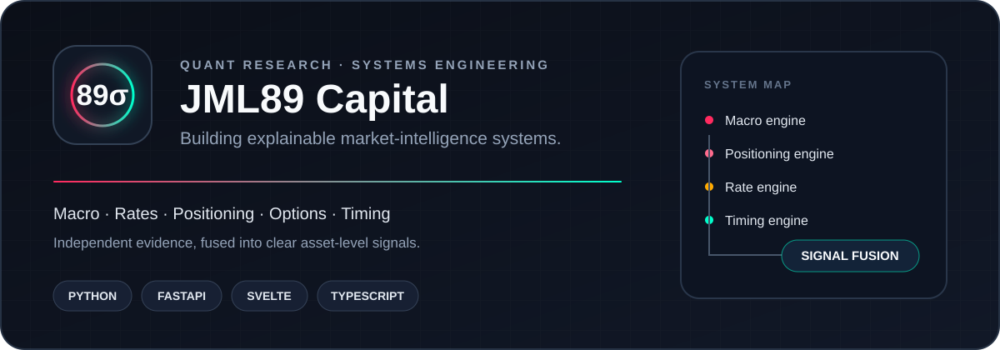

<picture>
  <source media="(prefers-color-scheme: dark)" srcset="./assets/profile-card-dark.svg">
  <source media="(prefers-color-scheme: light)" srcset="./assets/profile-card-light.svg">
  
</picture>

## Building market intelligence systems

I build research infrastructure that turns macro data, rates, institutional
positioning, options activity, and price behaviour into explainable market
signals.

My main project is **89σ Capital**, a private multi-asset research platform with
Python modelling, a FastAPI service, and a real-time Svelte interface. The source
and trading parameters remain private; the architecture and product work are
documented in the public
[market-intelligence-dashboard](https://github.com/jml89capital/market-intelligence-dashboard)
case study.

### Current focus

- Explainable signal fusion across independent market-data engines
- Robust out-of-sample testing and strategy validation
- Clear interfaces for complex quantitative research
- Reliable data pipelines, caching, and operational monitoring

### Core stack

`Python` · `FastAPI` · `Svelte` · `TypeScript` · `pandas` ·
`scikit-learn` · `statsmodels` · `GitHub Actions`

> Building in private, documenting in public.
